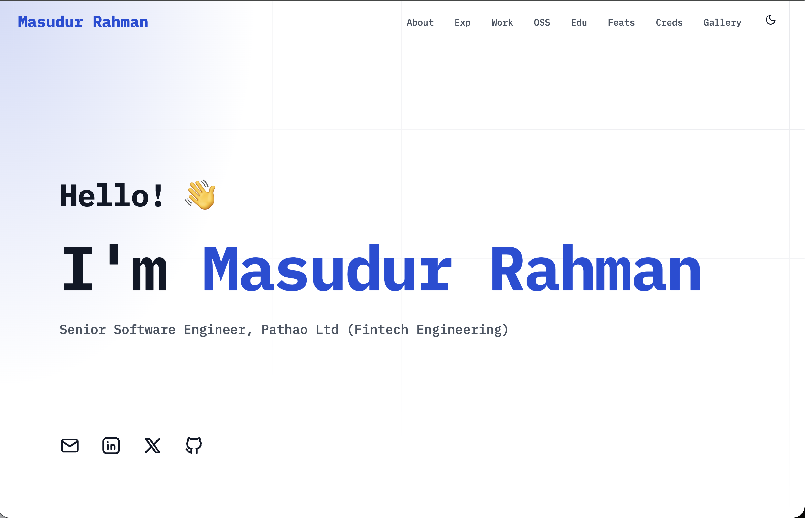

# Masudur Rahman's Personal Portfolio

This is the source code for my personal portfolio website, live at [mrahman.xyz](https://mrahman.xyz).

<picture>
  <source media="(prefers-color-scheme: dark)" srcset="public/images/mrahman.xyz_dark.png">
  <source media="(prefers-color-scheme: light)" srcset="public/images/mrahman.xyz_light.png">
  
</picture>

## Key Features

*   **Fully Responsive:** Built with a mobile-first approach and enhanced to ensure a seamless experience on all devices.
*   **Dynamic Viewport Sizing:** Uses `dvh` to prevent content from being hidden by mobile browser toolbars.
*   **Interactive Gallery:** The image gallery includes navigation buttons and swipe functionality for easy browsing.
*   **Comprehensive Sections:** Includes dedicated sections for Open Source contributions, certifications, and achievements.
*   **Rich Experience Timeline:** The experience section supports detailed bullet points with associated tools and technologies.

## Built With

*   **[Astro](https://astro.build/)** - Static site generator
*   **[Tailwind CSS](https://tailwindcss.com/)** - Utility-first CSS framework
*   **[Tabler Icons](https://tabler.io/icons)** - Open source icons
*   **TypeScript**

## Configuration

This portfolio is designed to be easily customized through the `src/config.ts` file. This single file controls all the content on the site.

### Basic Information
```typescript
export const siteConfig = {
  name: "Your Name",
  title: "Your Job Title",
  description: "A brief description for SEO purposes.",
  accentColor: "#1d4ed8", // Hex color for the theme
};
```

### Social Links
```typescript
social: [
  {
    name: "Email",
    url: "mailto:your.email@example.com",
  },
  {
    name: "LinkedIn",
    url: "https://linkedin.com/in/yourprofile",
  },
],
```

### About & Skills
```typescript
aboutMe: "A paragraph about yourself.",
skills: ["Go", "Kubernetes", "Docker", "Prometheus"],
```

### Projects
Projects are categorized as `Professional`, `Academic`, or `Hobby`.
```typescript
projects: [
  {
    name: "Project Name",
    description: "A description of the project.",
    link: "https://github.com/your/project",
    skills: ["Go", "GraphQL"],
    category: ProjectCategory.Hobby,
    role: "Owner",
    timeline: "Jan 2024 - Present", // Optional
  }
],
```

### Open Source Contributions
```typescript
openSourceProjects: [
  {
    name: "Kubernetes",
    description: "A brief description of your contribution.",
    link: "https://github.com/kubernetes/kubernetes/pull/12345",
    skills: ["Go", "Kubernetes"],
    role: "Contributor",
  }
],
```

### Work Experience
Bullets can be simple strings or objects containing `text` and a list of `tools`.
```typescript
experience: [
  {
    company: "Company Name",
    title: "Senior Software Engineer",
    dateRange: "Jan 2024 - Present",
    bullets: [
      "A simple string bullet point describing a responsibility.",
      {
        text: "A detailed bullet point with associated tools.",
        tools: ["Go", "Helm", "Kubernetes"],
      },
    ],
  }
],
```

### Education
```typescript
education: [
  {
    school: "University Name",
    degree: "Bachelor of Science in Computer Science",
    dateRange: "2018-2022",
    achievements: [
      "Graduated Magna Cum Laude",
      "Dean's List all semesters",
    ]
  }
],
```

### Achievements, Gallery, and Certifications
```typescript
// A simple list of strings
achievements: [
  "Certified Kubernetes Administrator (CKA)",
  "Rank 27 in ICPC Dhaka Regional 2017",
],

// Image gallery items
gallery: [
  {
    image: "/images/gallery/your-image.jpg",
    title: "Image Title",
    description: "A short description of the image.",
    date: "2025-10-18"
  }
],

// Certification details
certifications: [
  {
    name: "CKA: Certified Kubernetes Administrator",
    issuer: "The Linux Foundation",
    issueDate: "Oct 2025",
    expirationDate: "Oct 2027", // Optional
    credentialId: "LF-123456", // Optional
    credentialUrl: "https://www.credly.com/your/badge",
  }
]
```

## Deployment to GitHub Pages

This project can be easily deployed using GitHub Pages.

### 1. Configure Astro for GitHub Pages
In the `astro.config.mjs` file, set the `site` property to your GitHub Pages URL.

```javascript
// astro.config.mjs
import { defineConfig } from 'astro/config';

export default defineConfig({
  site: 'https://masudur-rahman.github.io', // Your GitHub Pages URL
  // ...
});
```
If you are using a custom domain, like `mrahman.xyz`, set `site` to your custom domain URL:
```javascript
// astro.config.mjs
site: 'https://mrahman.xyz',
```

### 2. Add a GitHub Actions Workflow
Create a file at `.github/workflows/deploy.yml` and add the official deployment workflow from the [Astro documentation](https://docs.astro.build/en/guides/deploy/github-pages/#github-actions).

### 3. Set up Custom Domain (Optional)
To use a custom domain like `mrahman.xyz`:
1.  Create a file named `CNAME` in your `public/` directory.
2.  Inside the `CNAME` file, add a single line with your domain name: `mrahman.xyz`.
3.  Configure the DNS settings for your domain with your domain registrar to point to GitHub Pages. Follow the official [GitHub guide](https://docs.github.com/en/pages/configuring-a-custom-domain-for-your-github-pages-site) for this.

## Running Locally

To run this project on your local machine:

```bash
# 1. Clone the repository
git clone https://github.com/masudur-rahman/masudur-rahman-portfolio.git

# 2. Navigate into the directory
cd masudur-rahman-portfolio

# 3. Install dependencies
npm install

# 4. Start the development server
npm run dev
```

## Acknowledgements

This portfolio's design and structure were inspired by the `devportfolio` template created by [Ryan Fitzgerald](https://github.com/RyanFitzgerald).

---

This project is licensed under the MIT License. See the `LICENSE.md` file for details.